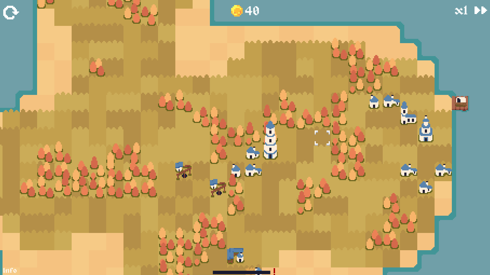

# Politismos
A trading game with procedurally generated islands!
## About

### Description
Politismos is a game that allows players to trade goods across a procedurally generated island. As the player becomes more successful, they can invest in their trading company, expanding their fleet of traders across the island.
  
The game generates islands entirely with perlin noise and gradient maps. Players start with a set amount of gold coins, and may buy and sell goods from various buildings and ports. People will get displeased if you neglect them for long periods of time, which will lead to a game over. Try to trade with everybody periodically!
  
Possible actions:
* Cut down forests, opening up trade routes
* Buy new carts at the port, allowing you to multitask
* Buy and sell goods between buildings and ships at port

Some info:
* The bar on the bottom of the screen shows the dissatisfaction levels, if this bar becomes full, the game is over
* You start with 30 gold, displayed in the top center of the screen
* Click and drag on the cart to select its path
* Hover over buildings to see the goods they buy/sell
* Hover over the port to buy a extra cart for 30 gold
* Click on forests to destroy for 5 gold
* Carts must be next to a structure to buy/sell goods
* Easter eggs!

More info:
* This is only an early prototype, if the island were to generate weirdly, just restart the level
* Currently there is no win condition, try to manage your resources as efficiently as possible and earn as much gold as you can
* Heavily inspired by [Hachinos (tiny cactus studio)'s artstyle](https://twitter.com/hachinos_)

### Technical info (Buy/sell prices of each good)
* Bread: 5/7
* Chicken: 20/26
* Coal: 15/20
* Gold: 35/46
* Iron: 25/33
* Meat: 15/20
* Paper: 10/13
* Potato: 3/4

### Technology
* Unity: Game engine to run the simulation
* C#: Backend logic
## Getting Started
### Deployment
Download instructions for users (for Windows only):
1. Download [Release1.0.0.zip](https://github.com/AustinKong/Politismos/releases/tag/1.0.0)
2. Unzip Release1.0.0.zip
3. Run Politismos.exe
### Dependencies
* Unity
### Installation
Installation and setup instructions for developers:
1. Install Unity Hub
2. Install Unity version 2020.3.30f1 or recommended LTS
3. Fork and clone the repository
4. Start coding and build something awesome!
### Contributing
This project is no longer under active development. Suggestions, issues and bug reports will not be actively resolved. However, pull requests and forks are always welcome!
## Help
### Controls
	Alt + F4 - Quit
	WASD/arrow keys - Move camera
	Left mouse button - Click to buy/sell goods, click on trees to destroy
	Mouse hover - Open structure & port's shop menu
	Click and drag - Move the cart around
	Restart (Top left) - Restart level
	Info (Bottom left) - Information & credits
	Speed (Top right) - Toggle ingame time
	
## Authors
Austin Kong [@AustinKong](https://github.com/AustinKong)
## License
This project is licensed under MIT license. View license in [license.txt](license.txt)
